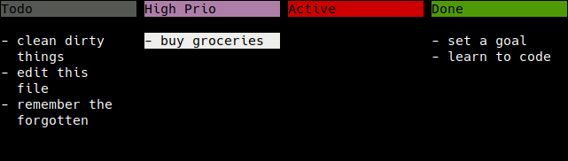
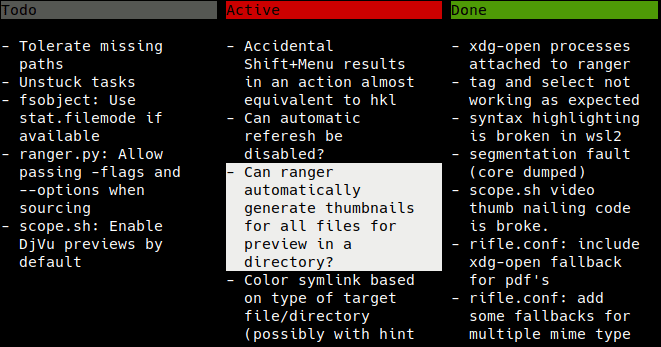

# Panban

NOTE: This project is a work in progress and is not suitable for general use.

A modular kanban tool with swappable front-ends and database interfaces.  It
allows you to view various kinds of structured data as a kanban board, with a
consistent UI.  Currently supported data formats are:

- Markdown lists (read+write)
- todo.txt (read+write)
- GitHub issues (read only)
- VTODO (CalDAV tasks, synced via e.g. vdirsyncer) (read+write)

# Key bindings

| key        | action                                                       |
|------------|--------------------------------------------------------------|
| j          | move down                                                    |
| k          | move up                                                      |
| h          | move to the column on the left                               |
| l          | move to the column on the right                              |
| 1-9        | move entry to column N                                       |
| `ENTER`    | edit entry                                                   |
| p          | edit task priority                                           |
| + or -     | add/remove "!plate" tag (for what's on your plate right now) |
| ! or @     | add/remove "!!!" tag (for important but not urgent tasks)    |
| z          | toggle visibility of metadata                                |
| o          | open first URL in task description in Firefox                |
| A          | add new entry                                                |
| X          | delete entry                                                 |
| R          | reload entries                                               |
| q or `TAB` | change the tab/project                                       |
| Q          | quit                                                         |

As of 2019-04-22, it is necessary to reload after certain operations to ensure
that the program doesn't crash.  To be on the safe side, just reload the data
with `R` after every operation.

# How to run

- `./panban.py -b todotxt test/todo.txt`
- `./panban.py -b markdown test/markdown.md`
- `./panban.py -b vtodo /path/to/calendar`

You can also use this to view github issues (read-only):

- `./panban.py -b github ranger/ranger`

