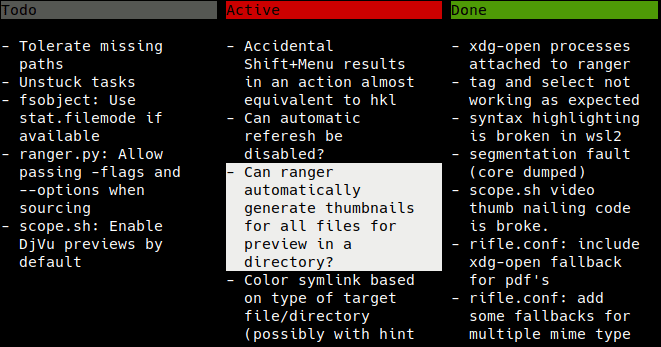

# Panban

**⚠️ This project is in the alpha stage, expect data loss ⚠️**

A modular kanban tool with swappable front-ends and database interfaces.  It
allows you to view various kinds of structured data as a kanban board, with a
consistent UI.  Currently supported data formats are:

- [Markdown lists](demos/markdown/README.md) (read+write)
- [todo.txt](demos/todotxt/README.md) (read+write)
- [GitHub issues](demos/github/README.md) (read only)
- [CalDav VTODO Tasks](demos/caldav/README.md), synced via e.g. [vdirsyncer](https://github.com/pimutils/vdirsyncer) (read+write)

# Key bindings

| key        | action                                                           |
|------------|------------------------------------------------------------------|
| h/j/k/l    | move left/down/up/right (vim-like keybindings)                   |
| `ENTER`    | edit task label                                                  |
| E          | edit task description                                            |
| p          | edit task priority                                               |
| 1-9        | move task to column N                                            |
| +/-        | add/remove tags                                                  |
| A          | add new task                                                     |
| X          | delete task                                                      |
| R          | reload tasks                                                     |
| z          | toggle visibility of task description                            |
| Z          | toggle visibility of metadata                                    |
| /          | filter entries by regex                                          |
| q          | filter entries by tag                                            |
| `ESC`      | reset filtering                                                  |
| o          | open first URL in task description in Firefox                    |
| B          | Experimental: Edit task description as markdown panban sub-board |
| s          | select the database source, if you opened multiple databases     |
| `TAB`      | next database source                                             |
| `S-TAB`    | previous database source                                         |
| Q          | quit                                                             |

# How to run

First download panban and install the dependencies:

```
git clone https://codeberg.org/hut/panban.git
pip install urwid  # required
pip install icalendar  # optional, for CalDav VTODO backend
pip install todotxtio  # optional, for todo.txt backend
cd panban
```

Then you can try out the desired backend with the provided demo database.

KEEP A BACKUP OF YOUR DATABASE. PANBAN IS STILL A WORK IN PROGRESS AND MAY CAUSE DATA LOSS

- `./panban.py demos/todotxt/todo.txt`
- `./panban.py demos/markdown/markdown.md`
- `./panban.py demos/caldav`

The format is automatically detected based on the file extension or URI.

You can also use this to view github issues (read-only):

- `./panban.py https://github.com/ranger/ranger`



# License

Copyright (C) 2023  Roman Zimbelmann

This program is free software: you can redistribute it and/or modify
it under the terms of the GNU General Public License version 3 as
published by the Free Software Foundation.

This program is distributed in the hope that it will be useful,
but WITHOUT ANY WARRANTY; without even the implied warranty of
MERCHANTABILITY or FITNESS FOR A PARTICULAR PURPOSE.  See the
GNU General Public License for more details.

You should have received a copy of the GNU General Public License
along with this program.  If not, see <https://www.gnu.org/licenses/>.
