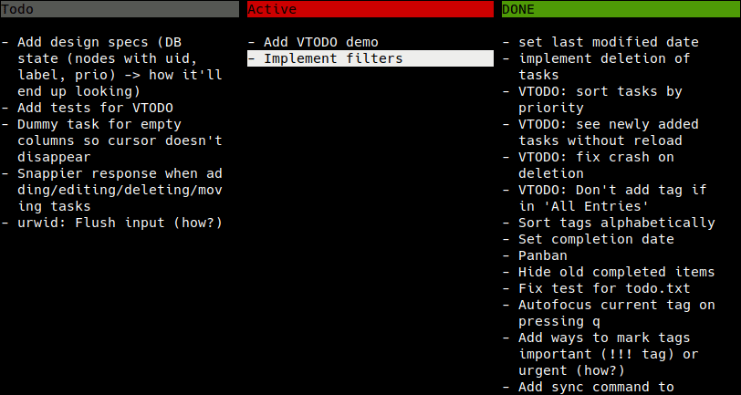
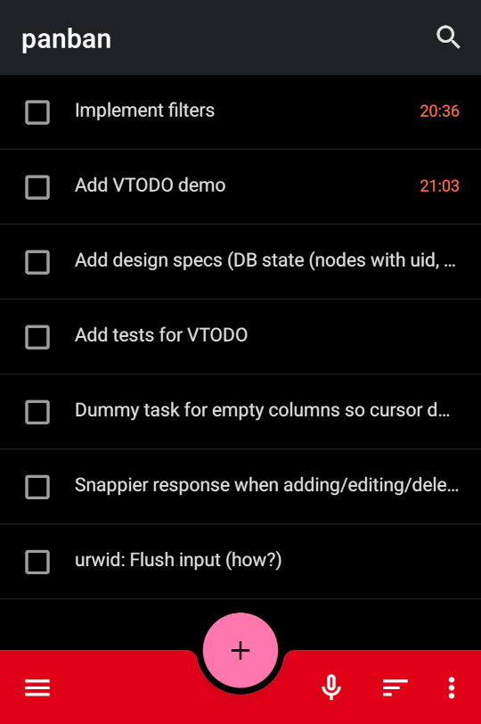

# CalDAV Backend

Panban can read/write [CalDAV](https://en.wikipedia.org/wiki/CalDAV) VTODO tasks, which is a common standard used by [NextCloud](https://nextcloud.com/), [DAVx5](https://www.davx5.com/), [Radicale](https://radicale.org/), Outlook, Google Tasks, [Tasks.org](https://tasks.org/), etc., by utilizing the [icalendar](https://icalendar.readthedocs.io) library.

The task files need to be accessible via the file system, so in order to access remote calendars from e.g. NextCloud, you need to sync them to the file system first with an application like [vdirsyncer](https://github.com/pimutils/vdirsyncer).

Try this command from the root directory of this git repository:

```
./panban.py demos/caldav
```

Here is an example screenshot of actual panban use during panban development:



And the same data as viewed on the Android app "[Tasks.org](https://tasks.org/)":


