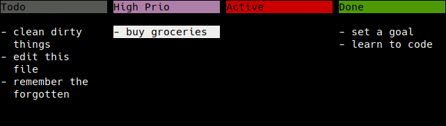

# Markdown Backend

[Markdown](https://daringfireball.net/projects/markdown/) is a common mark-up
language used by a wide range of productivity tools.

While Markdown doesn't actually define any standard for managing tasks, Panban can still open Markdown files in a format as [the markdown.md file in this directory](markdown.md), rendering headers as columns, and list elements as tasks.

As of 2023-04-22, this backend is not very stable and will e.g. remove any data that doesn't fit into the aforementioned pattern, like any paragraphs outside of lists.  It also doesn't support priorities or tags.  But if you only use Panban to modify hte markdown file, things should work out.

Try this command from the root directory of this git repository:

```
./panban.py -b markdown demos/markdown/markdown.md
```


