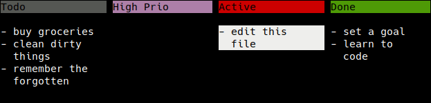

# Todo.txt Backend

Todo.txt is a plaintext file format that prioritizes simplicity and reliability over fancy features.  It's simple enough that you could edit it in any text editor if necessary, but for convenience, there are plenty of applications that provide a nice front-end for editing your todo.txt file.

Note that one major downside is the frequent synchronization conflicts if you
add/change tasks on several devices at once.

Panban can open and edit todo.txt files but is not feature complete yet.

Try this command from the root directory of this git repository:

```
./panban.py -b todotxt demos/todotxt/todo.txt
```


